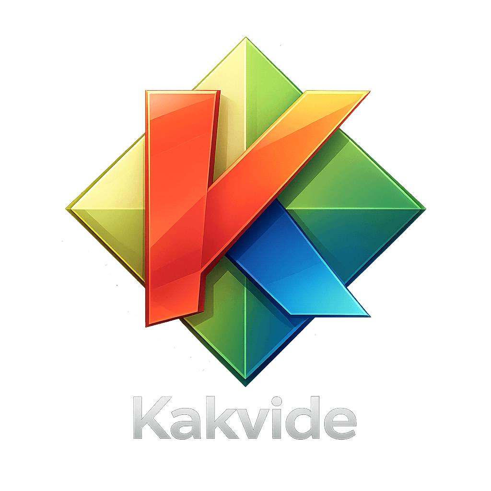

# Kakvide

Kakvide is a Neovide-inspired GUI for [Kakoune](https://kakoune.org/).

The spark for the project was a simple need: to open a Kakoune-like editor in a GUI window when there wasn't really one available.

It is built around Kakoune's `kak -ui json` mode, which made implementing the editor integration much faster than expected.

The overall architecture idea was taken directly from Neovide, including using `gl` for windows and `skia-safe` for cell rendering.

## Features

- Native GUI for Kakoune powered by `kak -ui json`
- Neovide-inspired rendering architecture using `gl` and `skia-safe`
- Kakoune-compatible face and color resolution
- Completion menus, prompt overlays, and modal UI rendering
- Live font size controls with keyboard shortcuts and reset
- Mouse forwarding and improved input handling
- Multi-window support for opening external files
- macOS app integration, including menus, document opening and file associations
- Custom app and window icons

## Work-in-progress

This is work in progress.

Some features aren't yet documented (e.g. see `kakvide.toml`), bugs are inevitable.

## LLM disclaimer

The code was developed with Codex/ChatGPT 5.4, with an adequate amount of handholding.
