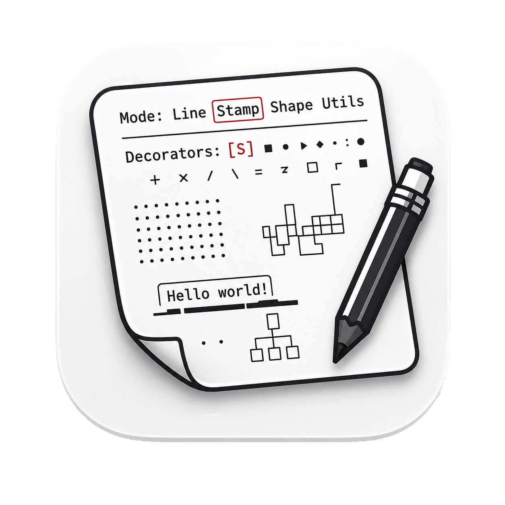
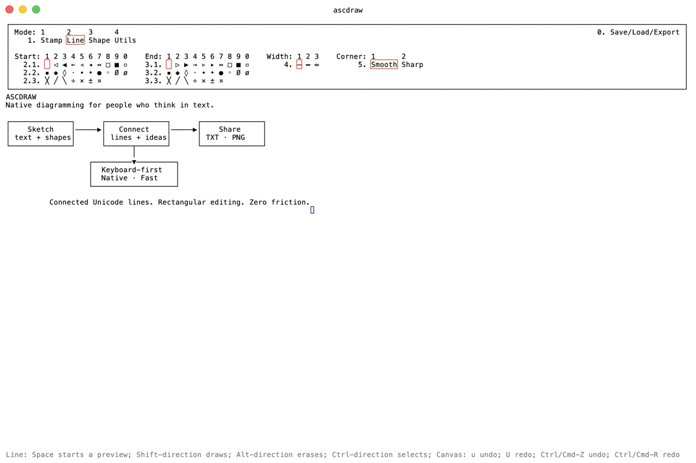
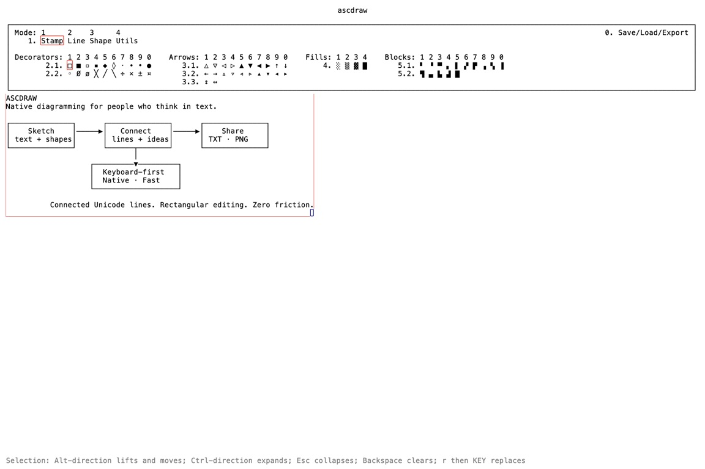

# ascdraw

<p align="center">
  
</p>

<p align="center">
  <strong>Native, keyboard-first diagramming for people who think in text.</strong>
</p>

ascdraw turns an effectively infinite text canvas into a fast diagram editor. Draw connected
Unicode lines, place symbols, build shapes, edit text, move rectangular regions, and export the
result without leaving the keyboard.



ascdraw is currently at **0.1.0**. The core editor is ready to use, while interfaces and the native
document format should still be considered evolving.

ascdraw is free software under the GNU GPL version 3 or later. Commercial licenses are also
available for organizations that cannot use the GPL; see [Licensing](#licensing).

## Why ascdraw?

- **Connected lines, not loose characters.** Strokes automatically become corners, tees, and
  crossings, with optional start and end markers.
- **Keyboard speed with visual feedback.** Arrow keys and `h` `j` `k` `l` drive every core editing
  operation; the toolbar doubles as a discoverable key map.
- **Text-native output.** Copy or save a diagram as TXT, export a crisp PNG, or preserve the full
  project as JSON.
- **Rectangular editing.** Select, clear, replace, copy, cut, paste, lift, and move regions without
  losing their layout.
- **Unicode-aware.** The grid is grapheme-aware and keeps wide characters intact.
- **A real desktop app.** Native windows, file dialogs, clipboard integration, multiple windows,
  autosave, live configuration reloads, and native macOS menus are built in.



## Build and run

The Rust toolchain for this repository is managed by
[mise](https://mise.jdx.dev/). Build the release binary with:

```sh
mise exec -- cargo build --release --locked
./target/release/ascdraw
```

Or install it locally from the checkout:

```sh
mise exec -- cargo install --path . --locked
```

Pass a native ascdraw document when you want a separate document instead of the normal autosave:

```sh
./target/release/ascdraw ./drawing.toml
```

Run `ascdraw --show-config` to print the merged configuration and every checked config path.

## Quick start

ascdraw opens in **Stamp** mode. A direction means an arrow key or its Vim equivalent: `h`, `j`,
`k`, or `l`.

| Action | Key |
| --- | --- |
| Move the cursor | direction |
| Jump across the visible canvas | `m`, then `hjkl` or arrow keys |
| Pan around the canvas | scroll or two-finger drag |
| Zoom the canvas | pinch or Ctrl/Cmd + scroll |
| Use the active tool with the mouse | click or click-drag (Line routes; Stamp/Shape hold Space) |
| Draw or apply the active Line/Stamp/Utils operation | Ctrl + direction |
| Place the active stamp | Space |
| Grow the rectangular selection | Shift + direction |
| Erase while moving | Alt + direction |
| Cancel the current interaction / collapse selection | Escape, Ctrl + `C`, or Ctrl + `G` |
| Clear selected cells | Backspace |
| Replace selected cells once | `r`, then one grapheme |
| Enter or leave Text mode | `i` or Shift + Return |
| Enter or leave continuous Replace mode | Return or Shift + `R` |
| Copy / cut / paste | Cmd + `C` / Ctrl/Cmd + `X` / Ctrl/Cmd + `V` |
| Undo / redo | `u` / `U` or Ctrl/Cmd + `Z` / `R` |
| Open Files/Togls | `0` |

Jump shows non-overlapping 21×15 sectors covering the visible canvas, with the initial selected
sector centered exactly on the cursor. A cursor-colored inner rectangle marks the selected sector;
move it with `hjkl` or the arrow keys, with or without Shift. After the configured inactivity delay from the last actual
movement, that sector becomes a centered 5×5 grid of 5×5 sectors and its landing timer starts
immediately. The resulting 25×25 refinement grid intentionally extends beyond the 21×15 sector.
Move again to restart the timer, or let it place the cursor at the selected sector's center. Landing
after normal movement moves only the cursor. Landing after Shift + direction selects the rectangle
from the cursor position where Jump started to the landed position; continue extending that
selection with Shift + direction. The most recent direction press determines whether landing
selects. In the second level, every direction press restarts the landing timer, including a press
against the grid edge. Moving past a grid edge pans the canvas by one sector, so Jump can continue
beyond the currently visible pane.
Configure the delay with `jump.inactivity-ms` (500 ms by default).

The first key of a toolbar path selects its group. Press `1`, then a mode number:

| Path | Mode |
| --- | --- |
| `1 1` | Stamp |
| `1 2` | Line |
| `1 3` | Shape |
| `1 4` | Utils |

The toolbar displays every remaining path. Short groups use `group option`; long groups add a page,
as in `2 1 3`. On a page, `1` through `9` choose the first nine entries and `0` chooses the tenth.
Pending prefixes are highlighted, and Escape cancels an unfinished path.
The toolbar's bottom-right corner shows the cursor as `(x,y)`, with right and down positive.

Press `0 5` to select Togls in the Files/Togls menu. Dark Mode (`0 5 1`) reverses the default
foreground and background while preserving explicit selection, highlight, cursor, and tooltip
accent colors. Multi Color Mode (`0 5 2`) adds the Colors mode, and Multi Layer Mode (`0 5 3`)
adds the Layers mode.

Colors provides base and bright eight-color ANSI-style palettes. The selected color applies only to
future nonblank text, replacements, stamps, lines, shapes, and pasted text. Existing glyph colors
and colors carried by move/cut operations are preserved. TXT export ignores color; PNG keeps it.

Layers are ordered bottom-to-top. Select, hide/show, reorder, add, or delete them from the Layers
menu; the base `⍺` layer cannot be moved or deleted. Editing affects only the selected layer.
TXT export chooses the highest visible nonblank glyph at each position, while PNG preserves every
visible layer.

### Faster movement and editing

The first held modifier chooses an operation. The second chooses how far it travels:

| First modifier | Operation | Add for 5 cells | Add for 10 cells |
| --- | --- | --- | --- |
| Shift | Grow the selection | Ctrl | Alt |
| Alt | Erase | Ctrl | Shift |
| Ctrl | Draw or apply the active tool | Alt | Shift |

## Drawing modes

### Stamp

Space fills the current selection with the active stamp. Ctrl + direction stamps continuously
while moving. The bundled inventory includes decorators, directional arrows, grey fills, and
quadrant blocks.

### Line

Ctrl + direction draws connected lines immediately. Starting on an existing segment extends the
connection; corners, tees, and crossings update automatically.

Space starts a routed preview. Move freely to reroute the current segment, then:

- press Space to commit the segment and start from its new anchor;
- press Space again without moving to finish;
- press Backspace to remove the latest committed segment;
- press Escape to cancel the live segment while keeping committed segments.

With the mouse, click once to anchor, move to preview, and click to commit another segment. Double
click finishes. A press-drag-release commits one segment and finishes immediately. Shift- and
Alt-drag keep their selection and move behavior.

Line options control the start marker, end marker, style (thin, heavy, double, or dashed), routing
(`H->V`, `V->H`, horizontal/vertical diagonal, or stairs), and corner style for thin and dashed
lines. Routing changes affect only the live or next segment. Dashed lines repeat `╴` horizontally
and `╵` vertically.

### Shape

Space starts a live shape preview. Move to size it and press Space again to place it. Shapes can be
rectangular or rounded, use thin, heavy, or double outlines, and have empty, shaded, or solid fills.

### Utils

Utils keeps its operations on direct keys:

| Key | Tool | Behavior |
| --- | --- | --- |
| `2` | Push | Insert a blank neighboring row or column |
| `3` | Pull | Remove and pull a neighboring row or column |
| `4` | View | Pan the viewport or center it on the drawing |

Operations that would split a wide grapheme are rejected.

## Text, selection, and clipboard

Text mode is independent of the selected drawing tool. Type to insert graphemes; arrows move freely
over the canvas, Backspace removes the preceding grapheme, Delete removes the following grapheme,
and Tab inserts four spaces. Escape, Ctrl + `C`, or Ctrl + `G` returns to the active toolbar mode.

Continuous Replace overwrites cells and extends rows when needed. In any drawing mode, `r` waits for
one typed or pasted grapheme, replaces the selected rectangle, and immediately returns to the active
tool.

Shift + direction expands the selection from its anchor. With an expanded selection, Alt + direction
lifts and moves the edited cells in the rectangle; blank cells remain transparent. A plain direction,
Space, or Return confirms it, while Escape, Ctrl + `C`, or Ctrl + `G` cancels.
Mouse drag crosses cells through these same direction commands: Shift-drag expands the selection and
Alt-drag moves an expanded selection (or erases when it is collapsed).
Scrolling a mouse wheel or dragging with two fingers on a touchpad pans the canvas horizontally and
vertically without moving the cursor.
Pinching, or scrolling while holding Ctrl or Cmd, zooms around the pointer location.
Clipboard paste overwrites a rectangle from the selection's top-left corner, preserves ragged rows
and trailing blanks, and selects the pasted result.

Undo and redo histories are independent per window. Document edits include the viewport state;
navigation and menu-only changes do not create history entries.

## Files, toggles, and export

Press `0` to open the top-right Files/Togls menu:

| Sequence | Action |
| --- | --- |
| `0 2 1` | Copy TXT |
| `0 2 2` | Copy PNG |
| `0 3 1` | Save TXT |
| `0 3 2` | Save PNG |
| `0 3 3` | Save JSON project |
| `0 4 1` | Load TXT |
| `0 4 2` | Load JSON project |
| `0 5 1` | Toggle Dark Mode |
| `0 5 2` | Toggle Multi Color Mode |
| `0 5 3` | Toggle Multi Layer Mode |
| `0 9` | Clear the canvas |

TXT and PNG use the expanded selection when one exists; otherwise they use the visible canvas
viewport. PNG export contains only the canvas—no cursor, selection border, preview, toolbar, title,
or tooltip. JSON stores the whole project, including cursor, selection, viewport translation, and
durable menu choices.

## Autosave and configuration

The canvas and durable menu choices are saved after five idle seconds, when a window closes, and
when the app exits. Without an explicit document path, the autosave lives at:

- macOS: `~/Library/Application Support/ascdraw/document.toml`
- Windows: `%APPDATA%/ascdraw/document.toml`
- Unix with `XDG_DATA_HOME`: `$XDG_DATA_HOME/ascdraw/document.toml`
- other Unix: `~/.local/share/ascdraw/document.toml`

Bundled application defaults live in [`ascdraw.toml`](ascdraw.toml), and bundled face defaults live
in [`theme.toml`](theme.toml). Put personal overrides in
`$XDG_CONFIG_HOME/ascdraw/config.toml`, or in `~/.config/ascdraw/config.toml` when
`XDG_CONFIG_HOME` is not set. The app watches this file and applies changes while running.

Theme faces include `default`, `selection`, `selection-highlight`, `jump-grid`,
`cursor-drawing`, `cursor-block`, and `tooltip`:

```toml
[theme.selection]
fg = "#ff0000"
bg = "default"

[theme.jump-grid]
fg = "#800080"
```

Colors are hexadecimal `#RRGGBB` or `#RRGGBBAA`. The value `"default"` inherits from the default
face. macOS builds also support configurable P3 or sRGB rendering.

## Development

Run the full local checks through mise:

```sh
mise exec -- cargo fmt --all -- --check
mise exec -- cargo test --locked
mise exec -- cargo clippy --all-targets --all-features --locked -- -D warnings
```

This repository uses Jujutsu as its version-control frontend. See [`AGENTS.md`](AGENTS.md) for the
project's change, test, symbol, and file-size conventions.

## Licensing

ascdraw is Copyright (C) 2026 Przemysław Alexander Kamiński vel xlii vel exlee.

The source code is available under the [GNU General Public License, version 3 or later](LICENSE).
Commercial licenses are available for use where the GPL's terms are unsuitable. For commercial
licensing inquiries, contact [alexander@kaminski.se](mailto:alexander@kaminski.se).

See [`NOTICE`](NOTICE) for the complete licensing notice.
