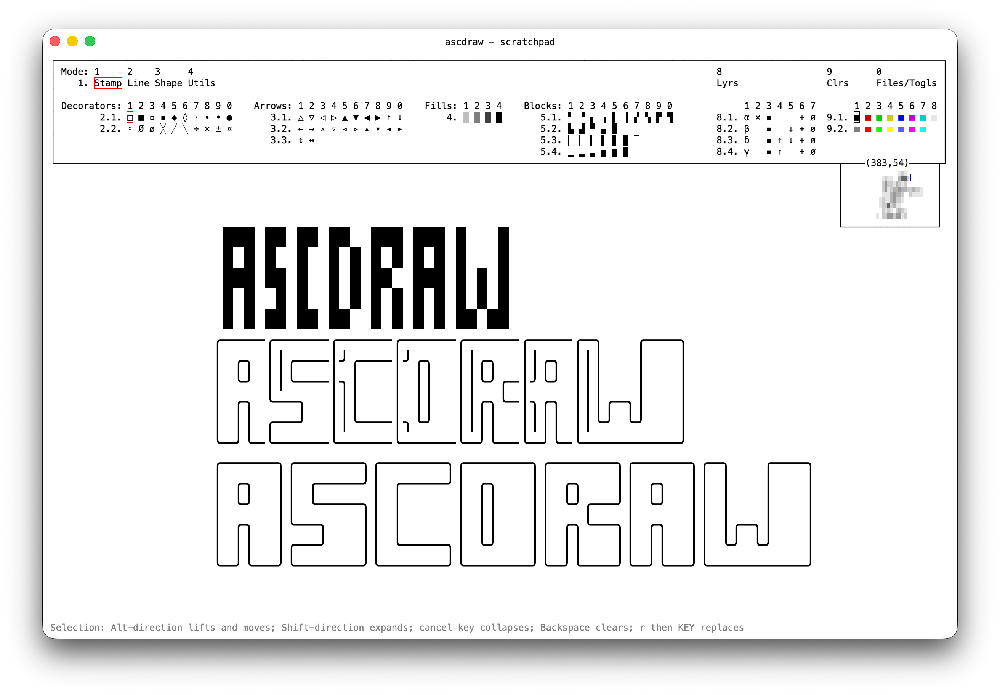
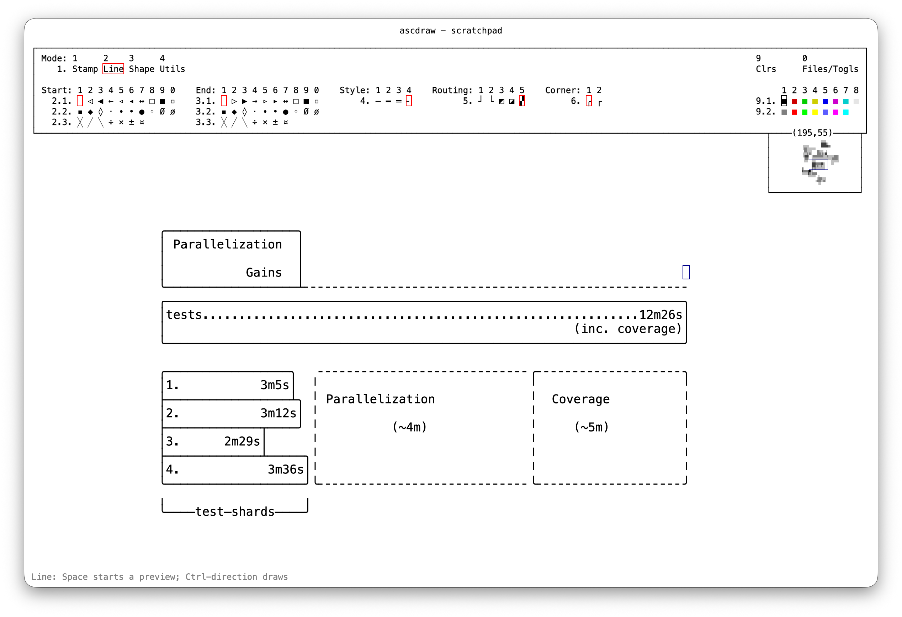
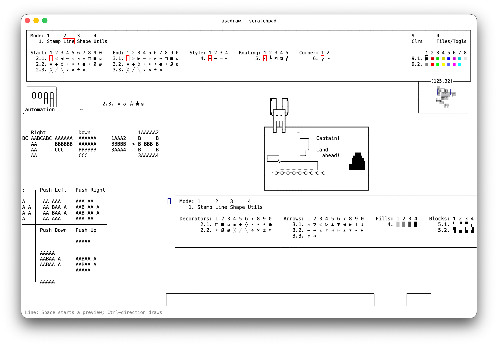

# ascdraw

> I value ascdraw at **$9.99 or €9.99 for a personal license**. It is GPLv3 software, so payment is entirely optional. If it is useful to you, please [fund its development](https://github.com/sponsors/exlee).

<p align="center">
  
</p>

<p align="center">
  <strong>Native, keyboard-first diagramming for people who think in text.</strong>
</p>

ascdraw is an effectively infinite Unicode canvas for connected lines, symbols, shapes, text,
rectangular editing, layers, and TXT/JSON/PNG export. It is usable today, but its interfaces and
document format are still evolving. The canvas renders at 120+ FPS, which matters more than you
might think in a keyboard-first editor.







## Get it

Download a current nightly from [GitHub Releases](https://github.com/exlee/ascdraw/releases), or
build it yourself with the Rust toolchain managed by [mise](https://mise.jdx.dev/):

```sh
cargo build --release --locked
./target/release/ascdraw
```

Install from a checkout instead:

```sh
cargo install --path . --locked
```

## Use it

ascdraw opens in **Stamp** mode. Numbered menus show their own keys; this table covers the less
obvious shortcuts. Directions are arrow keys or `h`, `j`, `k`, `l`.

| Action | Key |
| --- | --- |
| Move | direction |
| Draw/apply tool | Ctrl + direction |
| Place stamp / preview line or shape | Space |
| Select rectangle | Shift + direction |
| Erase / move selection | Alt + direction (moves when selection is expanded) |
| Text mode | `i` |
| Continuous replace mode | Return or Shift + `R` |
| Replace once | `r`, then a character |
| Jump across canvas | `m`, then direction |
| Clear selection | Backspace |
| Undo / redo | `u` / `U` or Ctrl/Cmd + `Z` / `R` |
| Copy / cut / paste | Cmd + `C` / Ctrl/Cmd + `X` / Ctrl/Cmd + `V` |
| Cancel | Escape, Ctrl + `C`, or Ctrl + `G` |

- **Stamp:** place symbols, arrows, fills, and blocks.
- **Line:** draw connected Unicode lines; Space starts a routed preview.
- **Shape:** draw outlined or filled rectangles.
- **Utils:** push/pull rows and columns, or pan the viewport.
- **Files/Togls (`0`):** load, save, export, change theme, and enable colors or layers.

Optional features:

- **Color:** choose from 16 ANSI-style colors for new text and drawing. PNG and JSON preserve
  colors; TXT does not.
- **Layers:** add, hide, reorder, and merge layers. Editing affects the active layer; PNG preserves
  the visible stack.
- **Dark Mode:** available, but less polished because I prefer and primarily use black on white.

In Line mode, Space starts a routed preview; move to route, Space commits an anchor, and Space
again finishes. Backspace removes the last anchor and Escape cancels the live segment.

Modifier order matters. The first chooses the action; the second changes its distance:

| First held | Action | Add for 5 cells | Add for 10 cells |
| --- | --- | --- | --- |
| Shift | Select | Ctrl | Alt |
| Alt | Erase | Ctrl | Shift |
| Ctrl | Draw/apply tool | Alt | Shift |

Scroll or two-finger drag to pan. Pinch or Ctrl/Cmd + scroll to zoom. Most tools also support
clicking and dragging.

Open a document directly with `ascdraw drawing.json`. Use `ascdraw -` to edit piped text and write
the result to stdout when the window closes.

## Configure it

Bundled defaults are in [`ascdraw.toml`](ascdraw.toml) and [`theme.toml`](theme.toml). Put overrides
in `$XDG_CONFIG_HOME/ascdraw/config.toml`, or `~/.config/ascdraw/config.toml`. Changes reload while
the app is running. Run `ascdraw --show-config` to see the merged configuration and searched paths.

Only include values you want to override:

```toml
font-family = "SF Mono"
font-size = 14.0
transparent-menubar = true

[jump]
inactivity-ms = 500

[keys]
font-scale-up = "Cmd-="
font-scale-down = "Cmd--"
window-new = "Cmd-N"

[theme.default]
fg = "#000000"
bg = "#ffffff"

[theme.cursor-drawing]
fg = "#00008b"
```

Colors use `#RRGGBB` or `#RRGGBBAA`. Theme faces and all available settings are listed in the two
bundled default files linked above.

## Develop it

```sh
cargo fmt --all -- --check
cargo test --locked --quiet
cargo clippy --all-targets --all-features --locked -- -D warnings
```

OpenAI GPT-5.5 and GPT-5.6 Sol aided development. Mostly.

## License

Copyright (C) 2026 Przemysław Alexander Kamiński vel xlii vel exlee.

ascdraw is released under the [GNU General Public License, version 3 or later](LICENSE). Commercial
licenses are available where GPL terms are unsuitable; contact
[alexander@kaminski.se](mailto:alexander@kaminski.se). See [`NOTICE`](NOTICE) for details.
