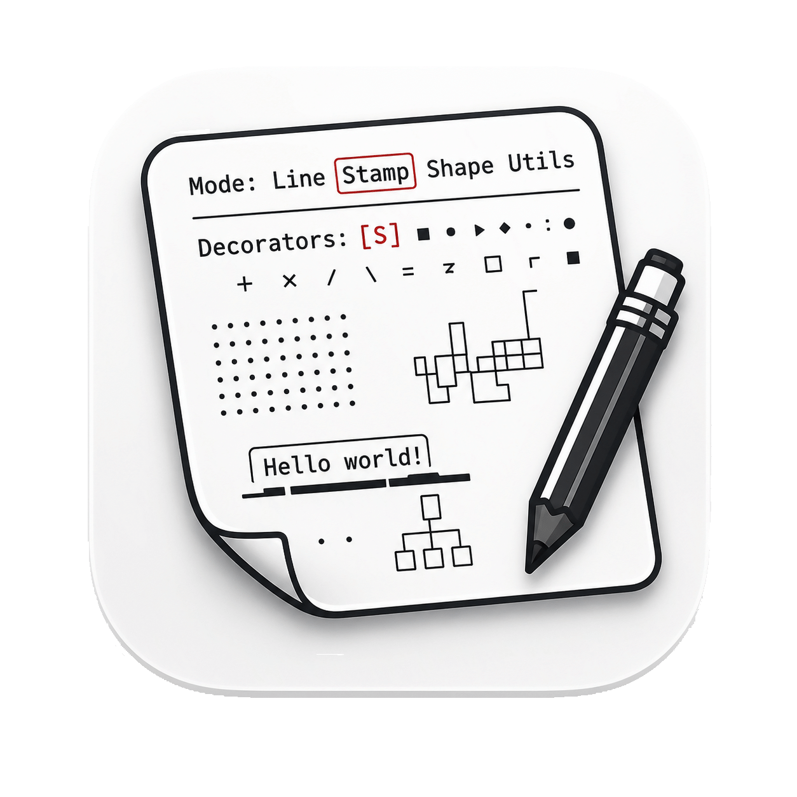
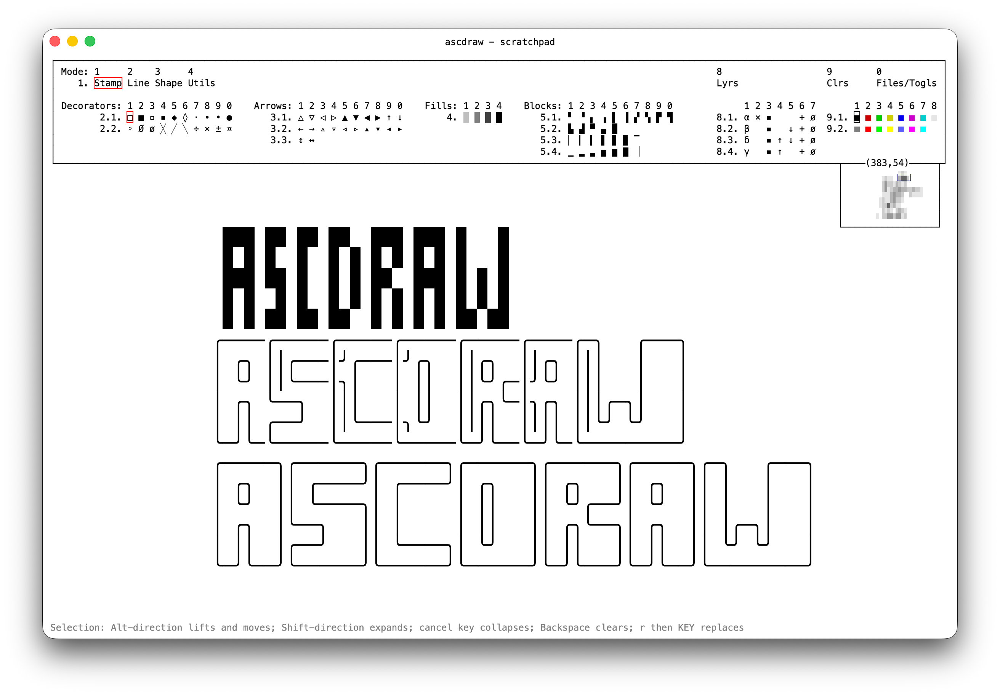
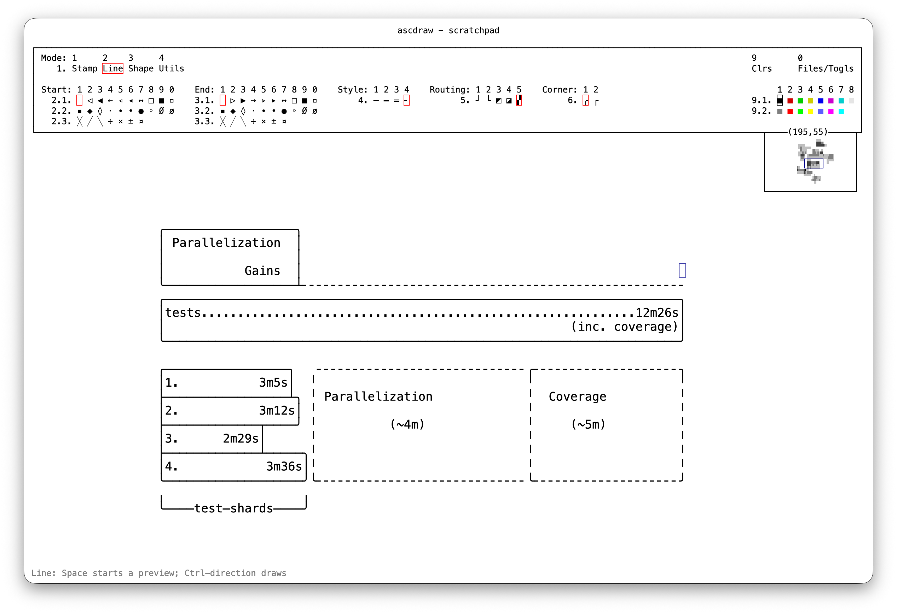
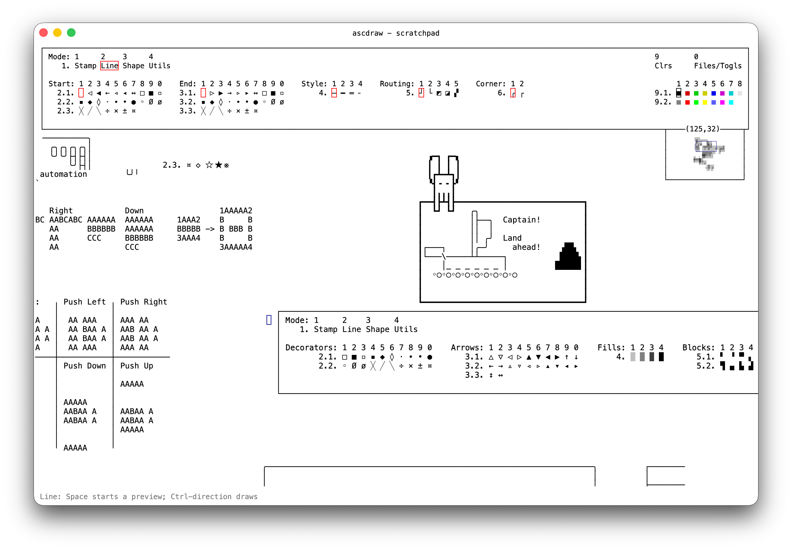

# ascdraw

> I value ascdraw at **$9.99 or €9.99 for a personal license**. It is GPLv3 software, so payment is entirely optional. If it is useful to you, please [fund its development](https://github.com/sponsors/exlee).

<p align="center">
  
</p>

<p align="center">
  <strong>Native, keyboard-first diagramming for people who think in text.</strong>
</p>

ascdraw is an effectively infinite Unicode canvas for connected lines, symbols, shapes, text,
rectangular editing, layers, and TXT/JSON/PNG export. It is usable today, but its interfaces and
document format are still evolving. The canvas renders at 120+ FPS, which matters more than you
might think in a keyboard-first editor.

## Changelog

- **2026-10-04** — Added morphable Objects: reusable rectangles that stretch, anchor, and keep
  local edits per copy.

[](https://youtu.be/N6sbp77WV3w)







## Get it

Download a current nightly from [GitHub Releases](https://github.com/exlee/ascdraw/releases), or
build it yourself with the Rust toolchain managed by [mise](https://mise.jdx.dev/):

```sh
cargo build --release --locked
./target/release/ascdraw
```

Install from a checkout instead:

```sh
cargo install --path . --locked
```

The Linux nightly is built on Ubuntu 22.04, so it needs glibc 2.35 or newer. On an older
distribution, build from source.

## Use it

ascdraw opens in **Stamp** mode. Numbered menus show their own keys; this table covers the less
obvious shortcuts. Directions are arrow keys or `h`, `j`, `k`, `l`.

| Action | Key |
| --- | --- |
| Move | direction |
| Draw/apply tool | Ctrl + direction |
| Place stamp / preview line or shape | Space |
| Select rectangle | Shift + direction |
| Erase / move selection | Alt + direction (moves when selection is expanded) |
| Text mode | `i` |
| Continuous replace mode | Return or Shift + `R` |
| Replace once | `r`, then a character |
| Jump across canvas | `m`, then direction |
| Clear selection | Backspace |
| Undo / redo | `u` / `U` or Ctrl/Cmd + `Z` / `R` |
| Copy / cut / paste | Cmd + `C` / Ctrl/Cmd + `X` / Ctrl/Cmd + `V` |
| Cancel | Escape, Ctrl + `C`, or Ctrl + `G` |

- **Stamp:** place symbols, arrows, fills, and blocks. Copy one cell to use its glyph as a custom
  stamp until you select a bundled stamp.
- **Line:** draw connected Unicode lines; Space starts a routed preview.
- **Shape:** draw outlined or filled rectangles. Each rectangle becomes an object anchored in its
  corners.
- **Utils:** push/pull rows and columns, or pan the viewport.
- **Objects (`1 5`):** reuse a rectangle as a template. See [Objects](#objects).
- **Files/Togls (`0`):** load, save, export, change theme, and enable colors or layers.

Optional features:

- **Color:** choose from 16 ANSI-style colors for new text and drawing. PNG and JSON preserve
  colors; TXT does not.
- **Layers:** add, hide, reorder, and merge layers. Editing affects the active layer; PNG preserves
  the visible stack.
- **Dark Mode:** available, but less polished because I prefer and primarily use black on white.

In Line mode, Space starts a routed preview; move to route, Space commits an anchor, and Space
again finishes. Backspace removes the last anchor and Escape cancels the live segment.

Modifier order matters. The first chooses the action; the second changes its distance:

| First held | Action | Add for 5 cells | Add for 10 cells |
| --- | --- | --- | --- |
| Shift | Select | Ctrl | Alt |
| Alt | Erase | Ctrl | Shift |
| Ctrl | Draw/apply tool | Alt | Shift |

### Objects

An object is a saved rectangle. Every copy follows the definition, and each copy keeps its own local
edits on top.

| Key | Action |
| --- | --- |
| `2` Dfn | Save the selection as an object and open DfnEdt on it. |
| `3` Edt, then `1` Dfn | Edit the definition through the copy under the cursor (DfnEdt). Every copy updates. |
| `3` Edt, then `2` Lcl | Edit the local copy under the cursor (Edt). A space paints the cell empty, hiding the definition and anything below; it shows as a dimmed cell. Definition cells show dimmed. |
| `3` Edt, then `3` Res | Reset the copy under the cursor to its definition: no local edits, stretch, or growth. |
| `4` Anchr, then `1`–`9` | In DfnEdt, attach an anchor at the cursor: W NW N NE E SE S SW or `·`. Backspace on an anchor deletes the anchor; a second Backspace clears the cell. |
| Space | Place a copy of the last defined object. |
| Alt + direction / Alt-drag | Decided where the gesture starts: on text it only erases; on a copy (or the empty part of its box) it only moves the copy. |
| Double-click a copy | Open Lcl on it. |
| Ctrl + click a copy | Outside DfnEdt and Edt, dissolve the copy into plain text; the definition goes with its last copy. |
| Drag a copy edge or corner | In any mode outside DfnEdt and Edt the pointer turns into a resize arrow over an edge or corner; drag to resize from there. |
| Ctrl + direction | Outside DfnEdt and Edt, stretch the copy under the cursor. Toward the far side of its center the edge on that side grows; toward the center the opposite edge shrinks. Only that copy changes. |
| Backspace | Outside DfnEdt and Edt, clear text over the copy under the cursor; with nothing above, remove the copy. |
| Cmd + `C`, Cmd + `V` | Outside DfnEdt and Edt, on a copy, copy it; paste places a copy with the same local edits. Inside them Cmd + `C` copies cells. |

DfnEdt and Edt dim the rest of the canvas and stay on while you switch to other tools. Press Escape in any mode, or the same command again, to leave them. Inside them the copy is
ordinary canvas, and writing outside it grows the definition in DfnEdt. Edt never changes the copy boundary. Outside them, copies lie below ordinary text: writing over a copy leaves the copy unchanged, and moving or resizing a copy clears nothing. A selection carries the copies lying wholly inside it.

An object with a single copy has no separate definition: that copy's local edits are the definition. Its size stays a stretch, so resizing never loses structure.

Stretching a copy lengthens connected lines. Implicit groups, cells that touch or letters one space
apart, keep their shape and move proportionally. An anchored group keeps its offset instead: W and
E fix the distance from that side or from the next anchor in that direction, N and S do the same
vertically, the diagonal anchors fix both axes, and `·` keeps a fixed offset from the nearest
anchor.

Scroll or two-finger drag to pan. Pinch or Ctrl/Cmd + scroll to zoom. Most tools also support
clicking and dragging.

Edit a native document in place, with normal autosaving:

```sh
ascdraw drawing.json
```

Filter mode reads plain text from stdin, opens it for interactive editing, then prints the result to
stdout once the window closes. It does not touch the scratchpad:

```sh
ascdraw - < input.txt > output.txt
# or
printf 'box\n' | ascdraw - > output.txt
```

This also makes ascdraw usable as an external editor filter:

| Editor | Command |
| --- | --- |
| Kakoune | `|ascdraw -` |
| Neovim | `:%!ascdraw -` |
| Emacs | `M-| ascdraw - <RET>` |

## Configure it

Bundled defaults are in [`ascdraw.toml`](ascdraw.toml) and [`theme.toml`](theme.toml). Put overrides
in `$XDG_CONFIG_HOME/ascdraw/config.toml`, or `~/.config/ascdraw/config.toml`. Changes reload while
the app is running. Run `ascdraw --show-config` to see the merged configuration and searched paths.

Only include values you want to override:

```toml
font-family = "SF Mono"
font-size = 14.0
transparent-menubar = true

[jump]
inactivity-ms = 500

[keys]
font-scale-up = "Cmd-="
font-scale-down = "Cmd--"
window-new = "Cmd-N"

[theme.default]
fg = "#000000"
bg = "#ffffff"

[theme.cursor-drawing]
fg = "#00008b"
```

Colors use `#RRGGBB` or `#RRGGBBAA`. Theme faces and all available settings are listed in the two
bundled default files linked above.

## Develop it

```sh
cargo fmt --all -- --check
cargo test --locked --quiet
cargo clippy --all-targets --all-features --locked -- -D warnings
```

OpenAI GPT-5.5 and GPT-5.6 Sol aided development. Mostly.

## License

Copyright (C) 2026 Przemysław Alexander Kamiński vel xlii vel exlee.

ascdraw is released under the [GNU General Public License, version 3 or later](LICENSE). Commercial
licenses are available where GPL terms are unsuitable; contact
[alexander@kaminski.se](mailto:alexander@kaminski.se). See [`NOTICE`](NOTICE) for details.
